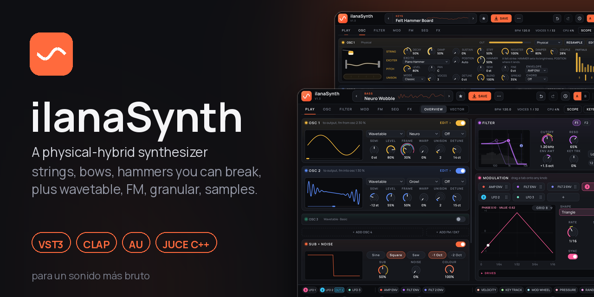
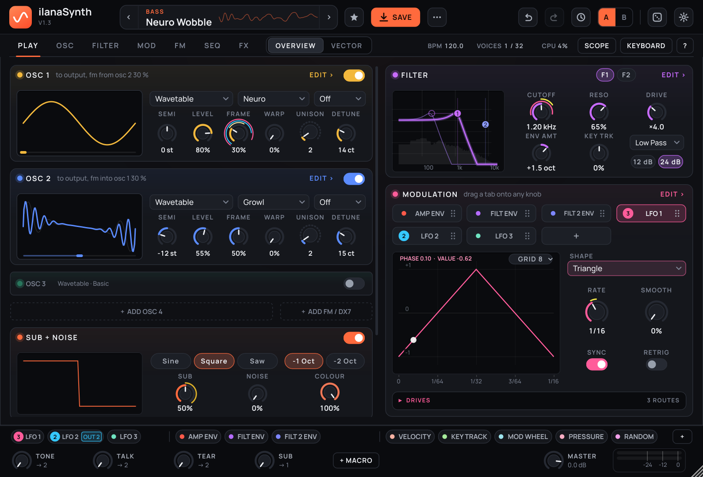
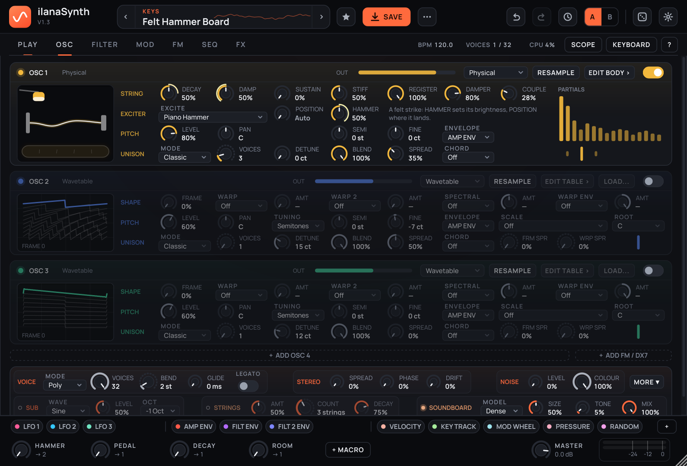
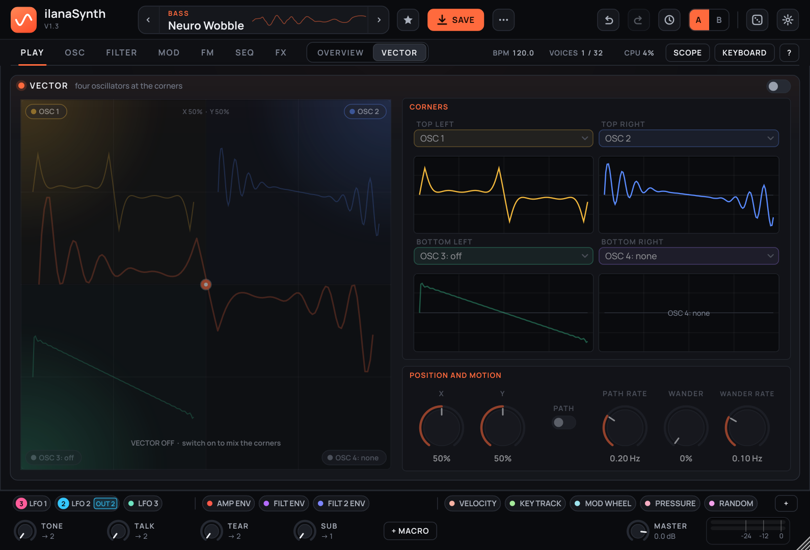
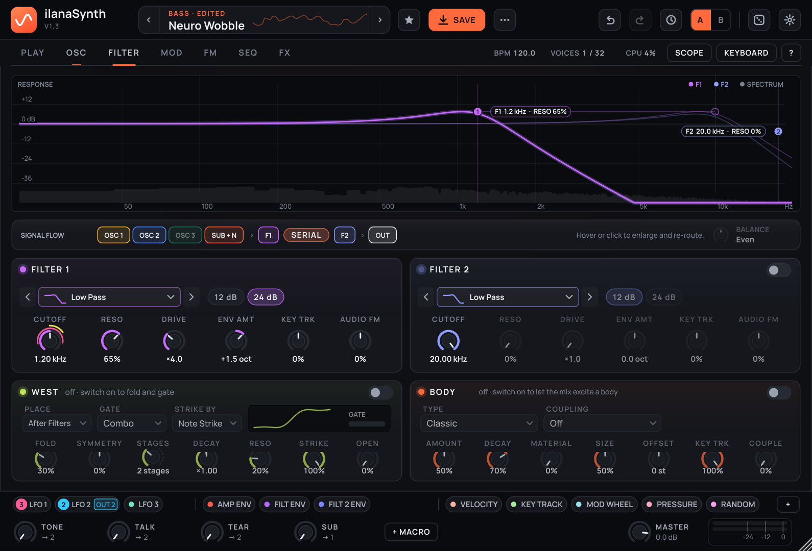
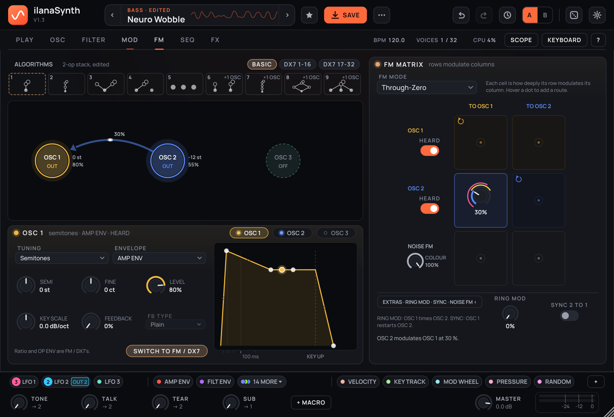
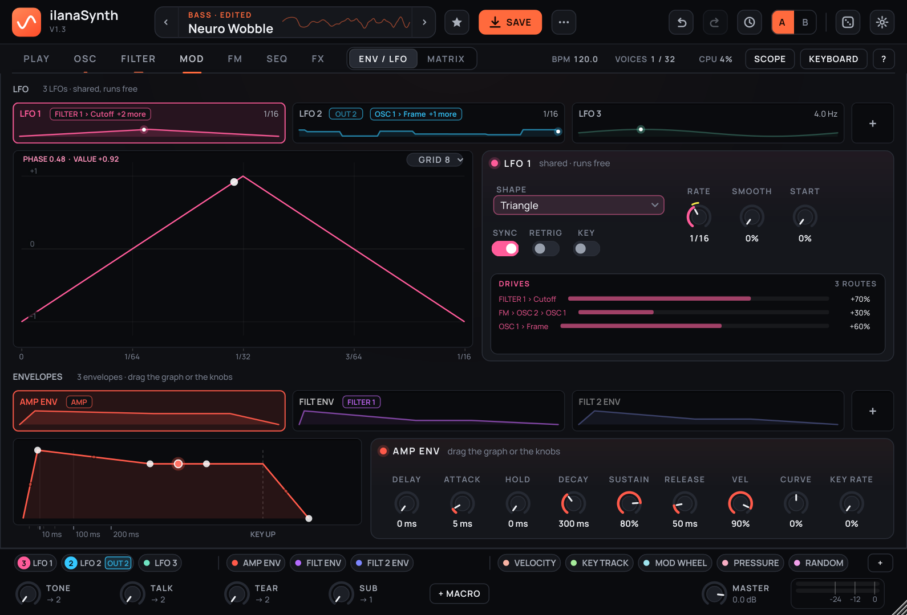
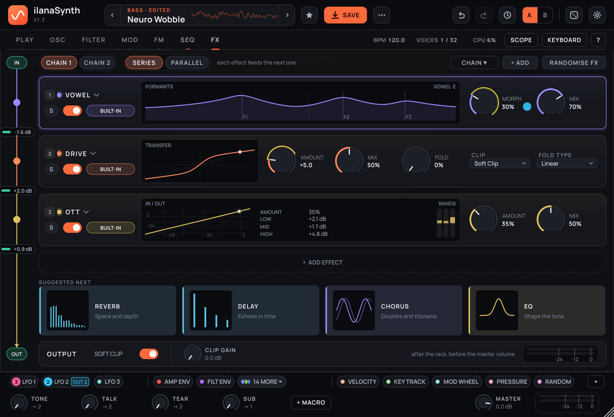

<p align="center"></p>

# ilanaSynth

**para un sonido más bruto** (for a more brutal sound)

A physical-hybrid synthesizer: strings, bows, hammers, electric pianos and resonant bodies you can break, wired into wavetable, FM / DX7, granular and sample engines, through two routable filters and a 41-type effects rack. VST3, CLAP, AU and standalone, built with [JUCE](https://juce.com). Version 1.3.0 plus everything merged since (see [Since 1.3](#since-13)).

<p align="center"></p>

ilanaSynth is a personal project. It is built for one person's music and is not packaged or licensed for redistribution (see [Licence and credits](#licence-and-credits)).

---

## What it is

A complete sound design machine, and the same engine as an effect plugin.

- **Oscillators:** six full oscillators, each in wavetable, FM / DX7, physical-model, sample, granular or live-input mode, plus a dedicated sub and noise layer. OSC 4–6 start off. Sample mode also plays SoundFont (SF2) and SFZ multisamples.
- **Wavetables:** 120 factory tables, a built-in wavetable editor (draw, harmonics, formulas, morphs, Serum / Vital-compatible import and export) and 16 patch tables saved inside the patch. Eleven spectral warps, classic warp modes (Sync, Bend, PWM, Mirror, Asym, Quantize, FM, Ring) and the Casio CZ's phase distortion.
- **Unison:** up to 16 voices per oscillator with eleven stack modes (Classic, Hypersaw, Octaves, Fifths, Center Drop, 2x Octaves, Power Chord, Major, Minor, Harmonics, Odd Harmonics).
- **Physical models:** plucked, bowed and hammered strings, a felt-hammer piano exciter on a dense soundboard, Rhodes- and Wurlitzer-style electric pianos (Tine, Reed), a feedback-guitar exciter, material bodies (bar, plate, bell, shell), sympathetic strings, a west-coast wavefolder with a vactrol low-pass gate, and a physical oscillator card that holds the whole string (decay, damping, stiffness, register, coupling, buzz, rattle) and its exciter, with a live picture of the string, hammer or bow.
- **FM and DX7:** a 6×6 operator matrix with 16 one-click algorithms and all 32 DX7 algorithms, three FM styles, the DX7's own Operator Envelope, key scaling, a pitch EG and LFO, a noise operator, 288 DX7 ROM and Dexed voices built in and `.syx` import for the rest.
- **Filters:** two routable filters (serial or parallel) with 39 models: zero-delay ladders, diode, OTA, SEM, MS-20, Steiner-Parker, 303 Acid, combs, vowel filters, Airwindows' Y filters and nine Airwindows character filters, and a tuneable Disperser.
- **Modulation:** 16 LFOs (including chaos and physics shapes), 16 tension envelopes, a step sequencer, an MSEG, 8 macros and a 64-slot matrix with per-route response curves. Drag any source onto any knob; the PLAY page's MODULATION card and the dock chips edit any source from any page.
- **Effects:** a 10-slot rack with 41 module types in series or parallel, including a trance gate, a channel vocoder and 54 Airwindows algorithms. Any slot can work on one band (low, mid, high, mid or side).
- **Generative tools:** an arpeggiator, a Euclidean sequencer, a probability sequencer, a clip sequencer with a piano roll and MIDI import / export, note spray, strum and scale snapping.
- **Presets:** 659 factory presets (371 sound-design presets and 288 DX7 voices), a tagged and searchable browser with a dockable side panel, favourites and user presets.
- **ilanaSynth FX:** a second plugin built from the same sources. Audio coming in rings the bodies and strings, is granulated live, or plays as an oscillator through the filters and effects.
- **Efficient:** SIMD in the hot paths, control-rate modulation and optional multi-core voice rendering; the heaviest presets now run in roughly half the CPU they did.

---

## A look around

| | |
|---|---|
|  |  |
| **OSC**: one card per oscillator. A physical oscillator carries its string and exciter rows and a live string picture (Felt Hammer Board shown). | **VECTOR**: an XY pad that mixes four oscillators, moved by hand, a path, drift or modulation. |
|  |  |
| **FILTER**: a full-width response display, 39 models and a signal-flow strip. | **FM**: the operator matrix, DX7 algorithms and the Operator Envelope. |
|  |  |
| **MOD**: envelopes and LFOs with route lists, step sequencers and the matrix. | **FX**: a vertical signal rail with a live row and display per effect. |

---

## Since 1.3

Everything below is on `main` and goes beyond the v1.3.0 release notes further down. Old patches and presets load and sound as before (every change is appended; parameter IDs and choice indices are never renumbered).

**Interface**
- **PLAY redesign:** a 52 px header, a tab bar carrying the BPM, voice and CPU readouts, and a dock of pill chips with a six-octave keyboard. PLAY is one 10 px grid of full-size oscillator strips (a big wave, menus and six knobs each, FM / DX7 operators with their own knobs and an envelope menu) that scroll past three.
- **MODULATION card:** one card with a tab per source (LFOs, envelopes, macros, performance sources), the selected source's graph and controls, and a DRIVES list of every route with a depth bar you can drag. **Dock chips** show their route count and a live trace, and a click opens that source's editor as a floating pop-out on any page.
- **Design pass on every page:** OSC, FILTER, ENV / LFO, FM and FX follow one set of mockups; text is about 10% larger; pages fold unused cards instead of leaving empty space (benchmarked against Vital and Serum 2).
- **Fifteen UI reviews** against Vital and Serum 2: undo for every gesture, MIDI learn on every control, a confirm before replacing an edited patch, draggable depth rings on every knob, a one-name-per-source colour scheme, a numbered and sortable matrix, SAVE in place and a themed SAVE AS, a dockable preset browser, wavetable browser with audition, clip editor selection and velocity lane.
- **Named macros:** every factory preset's macros are named for what they audibly do.

**Sound**
- **DX7 folded into FM:** there is no separate DX7 mode. **Operator EG** is an ENVELOPE choice any oscillator can use; **FM / DX7** is an oscillator type. The 8 ROM banks and Dexed voices are factory presets, and the preset menu imports any `.syx` file.
- **Airwindows:** the Low / Band / High Pass and Notch models are Airwindows' Y filters; nine character filters and a tuneable Disperser join them. In the rack, ten category modules (Tape, Saturation, Reverb, Delay, Modulation, Dynamics, EQ, Console, Lo-Fi, Stereo) pick from 54 ported algorithms.
- **Spectral warps, unison and drive (Vital parity):** Low Pass, High Pass, Phase Disperse, Random Amps and Skew spectral warps; Formant and Squeeze warp modes; seven new unison stack modes; **FRM SPR** and **WRP SPR** spread each unison voice's wavetable frame and warp amount; **Hard Clip** (and Soft Clip) drive modes and a **Sine Fold**; and a per-oscillator **scale quantize** (scale and root, semitone tuning).
- **Vocoder, splitters and more:** a channel vocoder (audio input or a built-in Talk modulator), FX band splitters (low / mid / high, mid / side), parallel FX routing, SF2 / SFZ multisamples, Scala microtuning and MTS-ESP.
- **Modulation curves:** any matrix route can carry a drawn response curve; LFO shapes are drawable; MIDI CCs drive all 8 macros.
- **Spectral morph, per voice:** a route from a per-note source (an envelope, velocity, key track, random, or a retriggered LFO) into SPEC AMT now gives every voice its own morph position, so held chords can sweep through the table voice by voice. Spectral warps also work on your own patch tables.
- **Stereo modulation amounts:** each matrix row has an **ST** toggle; on a filter cutoff it opens one filter side and closes the other, for wide, moving filters.
- **Audio import:** two more ways to turn a recording into a wavetable, **Vocode** (harmonic levels from the audio's spectrum) and **Time Slice** (the audio cut into cycles), in the wavetable editor's IMPORT menu.
- **Physical oscillator card:** the PHYSICAL tab is gone. Its string and exciter controls moved into the oscillator's own card on the OSC page; **EDIT BODY** opens the FILTER page, where the body lives.
- **Smoother and steadier:** master gain, effect mixes and amounts are smoothed (no zipper noise), effect state clears on patch change, A/B switching eases, and a stolen voice fades out instead of cutting.
- **Presets:** a diversity pass using the new filters and effects, more distinct archetypes per category, and ilana's own presets in `content/user-presets`.

**Performance and platforms**
- **CPU:** SSE2 / AVX paths for the wavefolder, Y filters, unison strings, soundboard and reverb; Vital-style control-rate modulation; release-silence freeing; block-wise FM operators; and optional **multi-core voice rendering** (`multi_core`, on by default). Output is byte-identical to single-threaded rendering.
- **GPU UI** (OpenGL) on macOS and Linux; Windows keeps Direct2D.
- **Self-hosted CI runner** for the Windows PC (`docs/SELF-HOSTED-RUNNER.md`); `tools/verify.sh` and `tools/verify.ps1` run the whole gate locally.

---


## What's new in 1.3

- **Generative card**: Euclidean rhythms, a probability sequencer and strum (M7.1).
- **BODY section**: bar, plate, bell and shell bodies with a MATERIAL knob, and string/body coupling (M7.2).
- **Electric pianos**: two new Physical exciters, **Tine** (Rhodes-style: a struck tine and tone bar read by a magnetic pickup) and **Reed** (Wurlitzer-style: a struck reed read by an electrostatic pickup, through its preamp). Pickup **DISTANCE** and **OFFSET** set how hard hard notes bark or growl; the display draws the pickup curve and the swing. The models are fitted to the default sounds of Arturia's Stage-73 V2 and Wurli V2. Presets: Tine Keys and Reed Keys.
- **Wavetable editor**: **EDIT** on any wavetable oscillator opens it. A frame list (add, duplicate, delete, reorder, up to 256 frames), **DRAW** with snap and smoothing, **SPECTRUM** bars for each harmonic's level and phase, **FORMULA** (for example `sin(2*pi*x) * (1 - f)`), basic **SHAPES**, **MORPH** between frames (crossfade or spectral), **IMPORT** (Serum, Vital and other tables, or any recording by resynthesis), **EXPORT** as a `.wav` Serum and Vital read, and a **LIBRARY** in `Documents/ilanaSynth Wavetables`.
  - Patches now keep **16 patch tables** (was 4 user slots), and store every edited or loaded table inside the patch, so a patch keeps its tables when the `.wav` moves or on another computer. Old patches load as before and embed their tables the next time they are saved.
- **ilanaSynth FX**, a second plugin (VST3 effect) with the same engine and presets, and an **INPUT** page:
  - an oscillator in **Live** mode plays the input through the filters, FM and effects
  - **LIVE** grains granulate the last three seconds of the input
  - **TO BODY** rings the BODY section; **TO STRINGS** drives Physical strings, tines and reeds
  - **TRIGGER**: Gate plays a note while the input is loud, Drone holds one down (no MIDI needed); MIDI notes work too
  - **Input Env**, the input's envelope, is a new modulation source (the INPUT chip)
  - input **GAIN** and **DRY**
  - quick starts: Live Body, Live Wah, Live Grains and Live Strings. The effect opens on Live Body.
- **Simulated LFO shapes** (M8.1): random family (Random Hold, Sine Random, Perlin, Drunk Walk), chaotic attractors and maps (Lorenz, Rössler, Duffing, Logistic, Hénon, Double Pendulum) and physics (Bounce, Pendulum, Spring, Friction), each with its own named knobs, SMOOTH, a second output (**LFO n B**, a new mod source) and FIRE to kick it.
- **Felt Hammer Board** (M8.2, formerly Grand Piano: it is a hammered string on a soundboard, not a piano): a new **Piano** exciter (a nonlinear felt hammer on a stiff, two-polarisation string with tension modulation) and a **Dense** soundboard, fitted note by note to the Salamander Grand (a Yamaha C5) across the keyboard at three dynamics. Preset: Grand Piano.
- **WEST** (M8.3): a west-coast card on the FILTER page, after the filters or in place of Filter 2: a wavefolder (FOLD, SYMMETRY, 1–4 stages) into a vactrol **low-pass gate** struck by each note or by any mod source (try LFO B with the Bounce shape).
- **13 more filter models** (M8.4), on a second page of the type grid: Ladder BP and Drive, SEM, OTA LP and BP, MS-20 HP, Steiner-Parker, Phaser Notch, damped and morphing combs, Vowel, Talking and Twin Peak.
- **Filter overhaul**: the analog models are rebuilt as zero-delay circuits solved every sample (the ladders, the MS-20 pair and Steiner-Parker at twice the sample rate), so full resonance self-oscillates exactly at the cutoff and plays in tune with key tracking; the Diode LP is a real diode ladder, the combs ring at their pitch. Old presets keep their level. Four new models: **303 Acid** (the TB-303's diode ladder with its feedback high-pass: resonance keeps the bass), **Moog Drive** (the ladder driven from inside), **Vowel Morph** (a five-formant vocal tract, A-E-I-O-U on MORPH, male to female voice with the cutoff) and **Comb Body** (a comb ringing a chime's modes). DRIVE goes inside the loop on 303 Acid and Moog Drive.
- **Feedback** exciter (M8.5): an amp and speaker in the string's loop, so a held note blooms into a harmonic; AMP GAIN and DISTANCE pick how and which.
- **VECTOR** page (M8.5): an XY pad mixing any four oscillators, moved by hand, by a drawn path, by drift or by modulation (Vector X / Y are mod sources), and **EVOLVE**: each macro drifts within a range, with FREEZE.
- **BOUNCE** (M8.6) on every oscillator card: renders the patch (one note, with or without its effects) in the background and puts it on that oscillator as a tuned sample or cut into a wavetable. The bounce is saved inside the patch; from there granulate it, warp it, or drive a string with it (Osc In).
- **PHYSICAL** page (M8.7; since folded into the oscillator card): an animated view of a Physical oscillator's string, its hammer, pick, bow or amp, and the body, with that string's controls and the body and soundboard switches.
- **Preset pack** (M10): 114 new presets across all of the above (strings, six-oscillator layers, chaos and physics modulation, acoustic and electric keys, deep FM, phase distortion, generative, bodies, west coast and the new filters, feedback guitar, vector and Evolve, resampled sources, and ten for ilanaSynth FX), and **80 new wavetables** (120 in all, with new Keys and Bass categories).
- **Formats and platforms** (M9): **CLAP** versions of both plugins, **AU** on macOS, Linux VST3/CLAP/standalone builds, and CI that builds and tests every change on Windows, macOS and Linux (including the pluginval and CLAP validators).
- Old patches and sessions load and sound as before.

---

## What's new in 1.2

- **Six full oscillators**: OSC 4–6 join the first three, each with every mode. They're added with **+ ADD OSCILLATOR** and cost nothing while off. Each picks its filter route and its own amp envelope.
- **PHYSICAL mode** replaces String mode (old patches convert and sound the same):
  - a stiff string with damping, pickup and excitation positions
  - pluck, **bow** (a stick-slip friction model; MPE pressure and aftertouch press harder) and **hammer** exciters, or any oscillator driving the string
  - sitar **bridge buzz** and velocity-driven **fret rattle**
  - **sympathetic strings**: up to six shared drone strings that follow the scale
- **Acoustic keys**: 1–3 coupled strings per note, a soundboard, stretch tuning, sustain-pedal resonance, a register map and mechanical noises. The engine is fitted towards a real grand.
- **Deep FM**:
  - **16 algorithms** in one click, from a 2-operator stack to DX7 layouts
  - operators tuned by ratio (snapping to harmonic, inharmonic or bell ratios) or at a fixed frequency
  - level and rate key scaling
  - Plain, Smooth, Cross Pair or DX7 feedback
  - the **Operator EG**: the DX7's own envelope generator for any oscillator (4 rates and 4 levels, break-point keyboard scaling, velocity and rate scaling, a pitch envelope and LFO), so the DX7 ROM banks and imported .syx voices are ordinary, editable patches
  - a **noise operator**
- **Phase distortion**: the Casio CZ's Saw, Square, Pulse and Resonance I–III waves as warp modes, a second warp stage (the PD chain), and a warp envelope like the CZ's DCW. The wave display draws the warped cycle.
- **16 envelopes**, now DAHDSR (delay and hold), with key-rate scaling. Any oscillator can also use the MSEG as its envelope.
- **16 LFOs**, including the physics shapes **Bounce, Pendulum, Spring and Friction**. Their two controls adapt to the shape, Pendulum has a note kick, and RETRIG restarts the motion on each note.
- **64-slot modulation matrix** (was 32).
- **QUALITY**: Eco, Normal or High, to trade detail for CPU.
- Old patches and sessions load and sound as before.

## What's new in 1.1

- **Filter page redesign**:
  - both filters side by side, each with a type grid and slope switch
  - a live signal-flow diagram
  - a balance control for parallel filters
  - the resonator
  - The XTRA page is gone: its controls live where you'd look for them.
- **MAIN is the hub**:
  - oscillator cards that follow each oscillator's mode
  - F1/F2 filter tabs
  - AMP / FLT 1 / FLT 2 / MOD / ENV 4 envelope tabs
  - LFO cards you can drag straight onto knobs
  - Each card's open button jumps to the full page.
- **OSC 3 is a full oscillator**, identical to OSC 1 and 2. The sub moved to its own section: sine, square or saw, one or two octaves down, with its own level and filter route.
- **FM page**: a 3-operator matrix.
  - Every oscillator can modulate every other oscillator and itself.
  - Three FM styles: Phase, Through-Zero and Exponential.
  - Each operator has an OUT switch, so it can be a silent modulator.
  - There's a draggable operator diagram.
- **40 wavetables in eight categories**, chosen from a visual table browser.
- **Spectral warps**: reshape a wavetable's harmonics per oscillator.
  - Modes: Stretch, Shift, Odd/Even, Formant, Smear, Harmonic Cut, Low Pass, High Pass, Phase Disperse, Random Amps and Skew.
  - Built in the background, and exact in offline bounces.
- **Granular oscillator mode**: a cloud of grains read from any sample, with position, size, density, spray, pitch spray and stereo spread. The display animates the grains; drag it to move the position.
- **Chaos LFOs**:
  - Smooth Random, Drunk (random walk) and Chaos (Lorenz attractor) shapes.
  - A **KEY** switch runs an LFO per voice at the note's own pitch, for audio-rate modulation.
- **Trance gate** with up to 16 editable steps (level per step), swing, smoothing and host sync.
- **Generative MIDI** (SEQ tab):
  - snap played notes to one of 16 scales
  - **note spray** adds random scale notes around every note you play (count, range, direction, strum spread, chance, velocity randomness)
  - the arp gets a **Scale Random** mode and a **chance** control
- **Envelope and LFO editing**:
  - The ADSR graph follows the mouse exactly.
  - The LFO section has been redesigned.
  - The envelope cards and LFO cards select in place.
- **FX rack**:
  - coloured, scrollable stacked modules (like Vital or Serum)
  - one-click effect buttons in an empty rack
  - an OUTPUT strip with the soft clipper
- **Scope** shows the waveform, spectrum, or both.
- **35 new factory presets** that show off the new features: drums (kick, FM snare, metal hat, granular clap, tom, rim), FM bells and growls, spectral keys and pads, granular choirs and swarms, chaos patches, trance-gated chords, generative patches, and FX.
- Fixed: tape stop no longer leaves latency behind after it's released.

---

## Features

### Oscillators (6)

Oscillators work like Phase Plant modules. OSC 1–3 are shown by default at full size. **+ ADD OSCILLATOR** (OSC and MAIN pages) adds the next one, switched on, and **×** removes one (switches it off and hides it). More than three cards scroll. OSC 4–6 are off and hidden in old patches and new Init patches; an oscillator that is on is always shown. The FM page's diagram and matrix show only the added oscillators.
- Six modes per oscillator (Wavetable, Physical, Sample, Granular, Live and FM / DX7, the operator type):
  - **Wavetable**: 120 factory tables in categories (Basic, Analog, Digital, Vocal, Spectral, Harsh, Organic, Chaos and more), plus 16 patch tables (User 1–16) saved inside the patch.
    - Click the TABLE box for the visual browser.
    - Load your own `.wav` with LOAD (as frames, or resynthesised from any recording), or drag a `.wav` onto the waveform display. Tables from Serum, Vital and other tools load with their frame size.
    - **EDIT** opens the wavetable editor (see *What's new since 1.2*). Editing a factory table copies it into a free patch table first; factory tables never change.
  - **Physical**: plucked, bowed, hammered or oscillator-driven string with adjustable stiffness (sharp upper partials), damping, pickup and excitation positions, pick hardness and position, and a slap attack.
    - **Bow**: a stick-slip friction bow (two waveguides either side of the bow) with pressure and speed; MPE pressure and channel aftertouch increase bow pressure.
    - **Hammer**: a felt hammer whose contact gets shorter (brighter) with velocity and HAMMER hardness. EXCITE POS is the strike point (1/8 by default).
    - **Osc In**: the string is driven by what the FM matrix feeds this oscillator, so any oscillator can strike or bow it.
    - **COUPLING**: with UNISON 2–3 and a small DETUNE, a note's strings share the bridge, giving a piano's fast first decay and long beating aftersound.
    - **DAMPER** stops the string once the key (and sustain pedal) is up; **REGISTER** makes treble strings stiffer and brighter and bass strings longer.
    - Bridge buzz and velocity-sensitive fret rattle are optional.
    - **Tine** and **Reed**: electric pianos in place of the string, with DECAY, DAMP (tone), pickup DISTANCE and OFFSET, HAMMER and DAMPER.
  - **Sample**: any `.wav` up to 120 s, or a **BOUNCE** of the patch itself (saved inside the patch).
    - Tuned or untuned playback, loop / one-shot, reverse, start and end points, and fades.
    - Five factory samples are built in: Metal Hit, Vocal Ah, Sub Tone, Vinyl Loop and Noise Rise. Right-click the display to pick one.
  - **Granular**: grains from the oscillator's sample (a vocal until you load your own).
    - Controls: POSITION, SIZE (10–500 ms), DENSITY, SPRAY, PITCH RND and STEREO.
    - In ilanaSynth FX, **LIVE** reads the grains from the incoming audio instead.
  - **Live** (ilanaSynth FX): the incoming audio, with LEVEL and PAN, into the filters, FM and effects.
- **Spectral warp** (wavetable mode): Stretch, Shift, Odd/Even, Formant, Smear, Harmonic Cut, Low Pass, High Pass, Phase Disperse, Random Amps or Skew, with an amount. The display shows the warped wave.
- **Warp modes**: Sync, Bend +, Bend −, PWM, Mirror, Asym, Quantize, FM and Ring, and the Casio CZ's phase distortion: PD Saw, PD Square, PD Pulse and the resonant PD Res I–III (try them on the Sine table).
  - Picking a warp opens a **WARP CHAIN** row: a second warp stage after the first, and a **WARP ENV** (any envelope or the MSEG) that opens both, like the CZ's DCW.
  - The display draws the warped wave.
- **Unison** up to 16 voices (8 in physical, sample and granular modes), with detune, stereo spread, stack mode (Classic, Hypersaw, Octaves, Fifths, Center Drop, 2x Octaves, Power, Major and Minor Chord, Harmonics, Odd Harmonics) and blend.
- **Per-oscillator controls**: level, pan, semitone and fine tuning, a filter route, chord modes, and an amp envelope picker (ENV 1–16, or the MSEG as a one-shot envelope).
- **SUB**: a dedicated sub oscillator (sine, square or saw, −1 or −2 octaves) plus a noise layer, sharing a filter route.
- **VOICE**: voice spread, unison phase randomisation and analogue drift.
- **QUALITY** beside oversampling: Eco caps each oscillator at four unison voices; Normal keeps the original rendering; High uses two half-step wavetable reads per output sample.
- **ACOUSTIC KEYS** on the OSC page, shared by every voice: a **soundboard** body (mix, tone for lid and mic position, size), **stretch tuning**, **pedal resonance** (with the sustain pedal, CC64, down the keyboard's strings ring in sympathy, with a bloom as the dampers lift) and **mechanical noises** (key release, damper felt, pedal), each with a level. Presets: Hammered Strings, Pedal Bloom, Honky Hammers, Bolted Strings, Bowed Board and Osc-Struck Strings (a hammered-string engine fitted towards a real grand, not yet a convincing piano, so the names do not claim one).
- **SYMPATHETIC STRINGS** on the OSC page: one to six shared drone strings ring from the mixed voices before effects. Choose amount and decay (a quarter second to 12 s ring time); tuning follows the GENERATE scale and root, or switch to six manual MIDI notes.

### FM
- A 6×6 matrix: rows modulate columns, and the diagonal is feedback.
- Only wavetable oscillators take FM as carriers. A Physical string takes it only with its Excite set to **Osc In**, where the incoming signal drives the string. Sample and Granular oscillators ignore it. Columns for oscillators that ignore FM are greyed out, and the diagram marks them **NO FM IN**. Every mode can still modulate the others.
- Styles: Phase, Through-Zero or Exponential.
- Each oscillator has an OUT switch; turn it off to make that oscillator a pure modulator.
- The operator diagram:
  - Drag from one oscillator to another to add or remove a route.
  - Drag onto an oscillator itself for feedback.
  - Click an oscillator to toggle its output.
- **Algorithms**: 16 one-click routings, from a 2-operator stack to seven DX7 algorithms. Click one to route the operators (it adds the ones it needs); the amounts stay editable, and the one the patch matches is lit.
- **Operator panel** (OP 1–6):
  - **TUNING**: Semitones, Ratio (with **SNAP** to harmonic, inharmonic or bell ratios) or Fixed Hz.
  - **FB TYPE**: Plain, Smooth (averaged and filtered: calm even at high amounts), Cross Pair (between the pairs 1-2, 3-4, 5-6) or DX7 (the DX7's own two-sample average).
  - **ENVELOPE** (any of the 16, the MSEG, or Op EG: the Operator EG), LEVEL and **KEY LVL** (level key scaling).
  - With **Op EG**, the card adds the envelope's graph, R1-R4 and L1-L4, OUTPUT, the keyboard scaling (BREAK, L/R DEPTH, L/R CURVE), RATE KEY, VEL and AMS; the **PITCH / LFO** tab holds the pitch envelope and the LFO they share.
- **Noise operator**: a NOISE row that frequency-modulates any oscillator with noise, with a colour control.
- Ring mod and hard sync (1 > 2).
- Every route is a modulation destination.

### Filters (2)
- 39 models in two pages of a type grid:
  - **BASIC**: Low, Band and High Pass and Notch (Airwindows' Y filters, 12 or 24 dB), Ladder LP and HP, Diode LP, MS-20 LP, Comb + and Comb −, Formant, Morph
  - **ANALOG, SHAPES and VOICE**: Ladder BP and Drive, SEM, OTA LP and BP, MS-20 HP, Steiner-Parker, Phaser Notch, damped and morphing combs, Vowel, Talking, Twin Peak, 303 Acid, Moog Drive, Vowel Morph, Comb Body
  - **AIRWINDOWS**: Z Low / High / Band Pass, Acid, X Low Pass, YNot, Holt, Angle, Pear, and a tuneable **Disperser** (an all-pass chain at the cutoff, key-tracked)
  - The analog models are zero-delay circuits solved every sample, so full resonance self-oscillates exactly at the cutoff and plays in tune with key tracking.
- Controls: cutoff, resonance (self-oscillating at the top), drive, envelope amount, key tracking, audio-rate FM and morph.
- **Routing:**
  - **Serial** (F1 into F2) or **parallel**, with a BALANCE control between the two filters in parallel.
  - Each source can go to Filter 1, Filter 2, both filters in parallel, or skip the filters.
- Drag the markers on the response display to set cutoff and resonance.
- **Resonator**: a tuned body after the filters, with amount, decay, offset and key tracking.

### Envelopes & LFOs
- **16 tension envelopes**: AMP, FILTER 1, FILTER 2, MOD, ENV 5 and ENV 6–16. The five original parameter sets keep their saved IDs.
  - They're shown as cards that mark the ones in use and name what each drives (for example "Filter 1" or "Filter1 Cutoff +2"). Drag a card onto a knob to modulate it. LFO cards do the same, and an LFO that drives nothing is drawn faint.
  - The ENV page starts with AMP, FILTER 1 and FILTER 2. Click **+** to add another; the cards narrow to fit, then the row scrolls sideways. Hover a card and click its **×** (or right-click it) to remove it: one that drives something asks first, and its routes go with it in one undo step. Envelopes in use (assigned in the matrix, as an amp envelope or by a filter's env amount) always show. LFOs work the same way: three cards and a **+**. What is shown is saved in the patch, and PLAY's envelope tabs list the same envelopes.
  - Drag the graph's handles for A / D / S / R; the value shows beside the handle. **CURVE** bends the attack, decay and release together, and the dot on each segment curves that segment alone. Double-click a handle or a dot to reset it. The time ruler sits under the graph.
  - Each is a DAHDSR: **DELAY** and **HOLD** knobs, plus **KEY RATE**, which shortens every stage up the keyboard.
- **16 LFOs** (LFO 1–3 shown by default, **+** for more; the card row scrolls past four):
  - Shapes, grouped in the SHAPE menu: Basic (Sine, Triangle, Saw up, Saw down, Square), Drawn (Draw, Steps, Curve), Random, Chaos and Physics. The older takes on some of these (the first S&H, Smooth Random, Drunk, Chaos and the classic physics shapes) sit under Legacy while a patch uses one.
  - **Steps** is a shape: the LFO's graph becomes 16 bars to drag.
  - Simulated shapes have two outputs: drag the **A** or **B** tag on the graph (or the card's **B**) onto a knob.
  - LFO 5–16 cost nothing until a mod slot uses them.
  - Free rate or host-synced divisions, and a start phase.
  - **RETRIG** runs the LFO per voice.
  - **KEY** runs it per voice at the note's pitch × RATE / 4 Hz.
- **The Curve editor**:
  - Click to add a point, drag to move it, drag a segment to bend it, and double-click a point to delete it.
  - Right-click for presets, grid, flip and reverse.

### SEQ, MSEG and the clocked S&H
- **MSEG**: a 4-stage looping shape with its own card after the LFOs on MOD > ENV / LFO, edited there (drag a point; right-click for shapes). It is also an oscillator ENVELOPE choice.
- **Clocked S&H**: a random value on every step of its DIVISION. Its card joins the LFO pool once a mod slot uses it.
- **Arpeggiator**: 9 modes (Up, Down, UpDown, Random, DownUp, Converge, Walk, Chord, Scale Random), 1–4 octaves, host-synced rate, gate and step chance, with a live pattern display.
  - While the host plays, steps lock to its beat grid. Notes start and stop on the exact sample they arrive.
  - It stops on All Notes Off, All Sound Off or when the host transport stops, so a clip whose note-offs go missing can't leave it running.
- **The Generative card** has three tabs:
  - **ARP**: the arpeggiator above.
  - **CLIP**: the clip sequencer: choose a clip (1–8), draw notes in the piano roll or import a .mid file. Double-click adds a note on the GRID (1/4 to 1/32, straight or triplet) at the last velocity set; click selects (shift adds), a drag on empty space selects a group; drag to move or resize, right-click or Delete removes; Ctrl+A / C / V / D select all, copy, paste (at the playhead, else after the selection) and duplicate; arrows nudge (shift: octave / bar). The lane under the roll sets velocities, Ctrl+wheel zooms in time, and a placed or picked note plays briefly (except in KEY TRANSPOSE while the clip is on). KEY TRANSPOSE plays it while a key is held, transposed from C3; HOST PLAY runs it with the host's transport.
  - **EUCLID**: a Euclidean rhythm. STEPS (2–32), HITS spread as evenly as possible over them, ROTATE, RATE and GATE. The ring shows the pattern and the step playing; drag on it to change the hits (up/down) or rotate (sideways). TARGET picks what it drives:
    - **Notes**: rests the arp's steps between hits. With the arp off, it plays the held chord on each hit.
    - **Exciter**: re-strikes the Physical strings of the notes held, on each hit, sample-accurately.
    - **Trance Gate**: the Trance Gate effect plays the rhythm (add the effect in FX).
  - **PROB SEQ**: a probability sequencer. Hold keys and it plays them through up to 16 steps. Each step has a CHANCE, a RANGE (how far above the key it may land, snapped to the scale) and a RATCHET (1–4 quick repeats). Drag in the lanes to draw; double-click a step to reset it. While on, it takes over from the arp.
  - While the host plays, all three lock to its bar.
- **Generate**:
  - Scale and root, with optional snapping of played notes.
  - **Note spray** adds random notes from the scale around each note you play:
    - 1–8 notes, up to 24 semitones away
    - upward, downward or both
  - **Strum** (Up or Down, with STRUM TIME): notes that start together, played chords and sprayed notes alike, come out one after another in pitch order.
    - a strum spread in ms
    - chance and velocity randomness

### Modulation
- **Matrix**: 64 slots with ENV 6–16 as additional sources and OSC 4–6 as additional destinations.
  - Each slot has depth, a response curve, polarity (Natural, Unipolar, Bipolar), a **Via** source that scales the routing, and bypass.
  - An empty matrix offers six one-click starters: LFO 1 > Cutoff, Mod Env > Frame, Wheel > Vibrato, Velocity > Cutoff, LFO 2 > Pan and Macro 1 > Drive.
  - Every FM cell, including those to and from OSC 4–6, is modulated per note, so envelopes and velocity shape each note's FM on their own.
- **Sources**:
  - LFO 1–16 and the MSEG
  - the MOD / FILTER 1 / FILTER 2 / AMP / ENV 5 envelopes, plus ENV 6–16
  - velocity, key track and random
  - mod wheel, aftertouch and expression
  - 8 macros and a clocked sample & hold
- **Drag a source chip or card onto any knob** to assign it.
  - Drag the coloured dot next to the knob to set the depth, or double-click the dot to remove the routing.
  - Hovering a source highlights everything it modulates.
- **Right-click any knob** for quick modulation, reset, copy/paste and MIDI learn.
- **Eight macros** with editable names (double-click a name). The dock shows four plus any in use, with a "+" that adds the next. Every factory preset names its macros for what they do, and EVOLVE can drift them.

### Effects rack (10 slots, 41 module types)
**Modules:**
- **Drive and dynamics**: Drive (tube / fuzz / clean), Bit Crusher, Amp, Compressor, OTT, Limiter, Utility
- **Modulation**: Chorus, Phaser, Flanger, Dimension, Tremolo, Comb
- **Delay and time**: Delay (with tape pitch and wow), Multi-Tap delay with a drawable tap grid, Feedback, Tape Stop
- **Space and texture**: Reverb (Room, Hall, Plate, Shimmer, Spring, Gated, and user IR loading), Smear, Freeze, Granular Stutter (reverse and pitch)
- **Vocoder**: a channel vocoder (8–24 bands) driven by the audio input or a built-in Talk modulator
- **Trance Gate**: patterns or up to 16 custom steps, with swing
- **Tone**: Tilt EQ, 3-band parametric EQ
- **Stereo and pitch**: Haas, Stereo Width, Frequency Shifter, Ring Mod, Octaver, Vowel filter
- **Airwindows**: 54 of Chris Johnson's Airwindows algorithms (MIT), in one all-in-one module and in ten category modules (Tape, Saturation, Reverb, Delay, Modulation, Dynamics, EQ, Console, Lo-Fi, Stereo), picked from a menu by family: tape and saturation (ToTape6, IronOxide5, Density, Spiral2, Tube2, Mojo...), consoles (Console7, Channel9), EQ (Air, Capacitor2, Baxandall2, Isolator2, Holt2), dynamics (Pressure5, ButterComp2, Logical4, Pop2), space (Galactic, kCathedral, Verbity2, Chamber, MatrixVerb), stereo (Wider, Srsly2, ToVinyl4), lo-fi (DeRez2, Deckwrecka, BitShiftGain) and character (DrumSlam, Inflamer, Flutter, ChorusEnsemble); the knobs take each algorithm's own names

**Rack controls:**
- Modules are coloured by family and stacked in a scrollable view.
- Every slot has bypass, blend, solo and a per-slot CPU readout.
- Drag rows to reorder them; bypass, solo and blend move with the effect.
- An empty rack offers one-click Reverb, Delay, Chorus, Drive, OTT, Trance Gate, Phaser and EQ.
- **A/B chains**, with copy A to B and save/load of whole chains.
- The OUTPUT strip has the soft clipper and clip gain.

### Voice & global
- **Voices**: 32-voice polyphony with a voice limit, Poly, Mono and Legato modes, and optional multi-core rendering (settings menu) that is byte-identical to single-threaded.
- **Glide and bend**: glide (optionally legato-only, with the LEGATO switch next to it) and pitch-bend range.
- **MPE mode** in the settings menu.
- **Microtuning**: Scala scales (.scl) with optional keyboard mappings (.kbm) from the settings menu (Tuning); saved inside the patch, STRETCH still applies on top.
- **Oversampling**: 2x or 4x for the voice engine (settings menu or the scope panel).
- **Output**: master volume, and 4 macros with MIDI learn.

### Scope
- A panel that floats over any page (SCOPE at the right of the tab row), or expands to fill it.
- Waveform, spectrum or split view, with HOLD and PEAK hold.
- Stereo meters with click-to-solo.

### Interface
- **Design**: calm flat graphite with one accent colour (4 themes), Manrope type with fixed-width digits, and glowing, animated controls: knob arcs flare as they move, switches slide, lit buttons breathe. Resize it from the corner (75–200%) or from the settings menu.
- **Tabs**: PLAY (overview with the MODULATION card, vector pad), OSC (oscillators; a physical oscillator's string and exciter live on its card), FILTER, MOD (envelopes and LFOs, step LFOs and MSEG, matrix), FM, SEQ and FX; tabs with several pages switch them at the right of the tab row. Number keys 1–7 switch tabs. Switched-off oscillators fold to one line, and the FX rack lists only the slots in use plus one to add to.
- **Header**:
  - preset name with category and an EDITED marker
  - previous / next and favourite
  - SAVE
  - undo / redo with history
  - COMPARE: flip between two versions of the patch (A and B)
  - DICE: randomise or mutate the patch, or one section of it
  - settings
- **Bottom bar**: the modulation source chips (click one to keep every knob it drives lit, click again to clear), the macros, glide, legato, master and an output meter (it lights red after a clip; click to reset). Voice mode, voice limit and pitch-bend range are in the settings menu (the gear). The on-screen keyboard opens with KEYS.
  - A source chip glows with its source's live value while that source modulates something.
- **Help**: tooltips on hover, and a welcome tour (re-open it with the `?` button).
- **Presets**: 659 factory presets: 371 sound-design presets in Bass, Lead, Pluck, Pad, Keys, Chords, Arp, Drone, Drums, Generative and FX, and 288 DX7 voices (the ROM banks and Dexed) filed by bank. The browser has search (names, categories and tags), favourites, user presets (including `.syx` import) and can dock as a side panel.

---

## Installing

### Windows: build and install from source (one click)
Double-click **`build-and-install.cmd`** in the repository folder.

**What it does:**
- Asks for administrator rights and builds the Release VST3 and standalone.
- Copies the VST3 to `C:\Program Files\Common Files\VST3\ilanaSynth.vst3`.
- Puts the standalone in `C:\Program Files\ilanaSynth`, with a desktop shortcut.
- Tells you what went wrong if a tool is missing.

**You need:**
- Visual Studio 2022 (Community or Build Tools) with *Desktop development with C++*
- Git
- internet access the first time (JUCE is downloaded)

Close your DAW first, then rescan plugins once it finishes. To update, pull the changes and run it again:

```powershell
git checkout main
git pull origin main
.\build-and-install.cmd
```

The script also installs **ilanaSynth FX** (`C:\Program Files\Common Files\VST3\ilanaSynth FX.vst3`). In Ableton Live it appears under Audio Effects: put it on an audio track (or after an instrument) and play into it. It needs no MIDI (use TRIGGER on the INPUT page); to play it from a MIDI track, set that track's MIDI To the FX track.

### Windows: installer
1. Run `ilanaSynth-1.3-Windows-Setup.exe`, which installs both plugins (VST3 and CLAP) and the standalone. Or copy the `ilanaSynth.vst3` folder to `C:\Program Files\Common Files\VST3\`.
2. Rescan your plugin folder in your DAW.
3. The standalone `ilanaSynth.exe` needs no DAW at all.

### macOS
Release builds (VST3, AU, CLAP and the standalone, universal) come from the Release workflow; they are signed and notarised when the repository has the Apple signing secrets (see `.github/workflows/release.yml`). To build it yourself (about ten minutes, and internet the first time for JUCE):

```bash
xcode-select --install   # Apple compilers, once
brew install cmake       # or the .pkg from cmake.org
cmake -B build -DCMAKE_BUILD_TYPE=Release
cmake --build build --config Release
```

Copy the built `ilanaSynth.vst3` to `/Library/Audio/Plug-Ins/VST3/` (or `~/Library/Audio/Plug-Ins/VST3/`), the `.component` to `/Library/Audio/Plug-Ins/Components/` and the `.clap` to `/Library/Audio/Plug-Ins/CLAP/`, then rescan in your DAW.

The standalone app is in `build/ilanaSynth_artefacts/Release/Standalone/`. If macOS refuses to open it, run `xattr -dr com.apple.quarantine <path to ilanaSynth.app>`.

### Linux
Install the build packages once (Debian/Ubuntu: `sudo apt install build-essential cmake ninja-build libasound2-dev libx11-dev libxrandr-dev libxinerama-dev libxcursor-dev libxext-dev libfreetype-dev libfontconfig1-dev libgl1-mesa-dev`), then:

```bash
cmake -B build -G Ninja -DCMAKE_BUILD_TYPE=Release
cmake --build build
```

Copy `build/ilanaSynth_artefacts/Release/VST3/ilanaSynth.vst3` to `~/.vst3/` and `build/ilanaSynth_artefacts/Release/CLAP/ilanaSynth.clap` to `~/.clap/` (the same for ilanaSynth FX). `-DILANA_CLAP=OFF` skips CLAP.

---

## Using it

- **Hover any control** for a description and its value.
- **Right-click a knob** to assign a modulation source, clear modulation, reset to default or copy/paste the value.
- **Drag a source chip or LFO/envelope card** onto a knob to modulate it.
- **Drag a `.wav`** onto an oscillator's waveform display to load it as a sample. This switches the oscillator to Sample mode, or keeps Granular.
- **Click the TABLE box** to browse wavetables visually.
- **SAVE** asks for a name, category and tags, and stores the preset in `Documents/ilanaSynth Presets`.
  - The FOLDER button in the preset browser opens that directory.
  - Use the `…` menu to export a preset file anywhere.
- **The preset browser** (click the preset name) drops down under the name, with every category (and Favourites and User) on the left, and search.
  - Click a preset to hear it. The browser stays open, so you can audition a few.
  - Up/Down step through the list, loading as you go. Enter or a double-click keeps the preset and closes the browser. Esc or a click outside also closes it.
  - Click the star on a row to make it a favourite. Right-click a row for more options.
  - **SURPRISE ME** loads a random preset from the list shown.

### Good to know
- The FX rack is empty on INIT: click any effect in the grouped list (Space, Drive, Motion, Rhythm, Tone & Level), or click any of the 10 rows.
- Spectral warps work on every wavetable, factory and your own patch tables.
  - Changing a warp's amount rebuilds the table in the background, so it isn't a modulation target.
  - To move the tone over time, modulate FRAME instead.
- Note spray and scale-random arps are random by design, so each playthrough differs.
- **Old patches:**
  - String mode loads as Physical at the same mode index. The new controls default to the old string sound.
  - OSC 3 was a sub-style oscillator before 1.1. Old patches are converted automatically on load, including the user wavetable slots, which moved to positions 41–44.
  - Older patches that used the XTRA page keep their settings; the controls now live on the FILTER, OSC and FM pages.

### Windows high-DPI displays
If the interface looks soft on a display scaled to 125–200%:
- In Live: **Preferences → Look/Feel → enable HiDPI mode**.
- Right-click the plugin's title bar (or its entry in Live's browser) and disable **Auto-Scale Plug-In Window**. Live upscales plugin windows, which softens everything; with it off, the interface is drawn 1:1.
- Choose a size from the settings (gear) menu, or drag the window's corner, so the window is a comfortable size while still rendering at native resolution.

---

## Building from source

**Requirements:** CMake 3.22+, a C++20 compiler, and internet access for JUCE (fetched automatically).

```bash
cmake -B build -DCMAKE_BUILD_TYPE=Release      # Windows: cmake -B build
cmake --build build --config Release
```

**Targets:**
- `ilanaSynth_VST3` and `ilanaSynth_Standalone`
- `ilanaTableTest`: the offline regression suite
- `ilanaSnapshot` and `ilanaFingerprint`

**Tools:**
- `ilanaSnapshot snapshots/out [factory preset index]` renders every tab, sub-tab and FX module panel to PNGs, without a DAW or display.
- `ilanaSnapshot --uitest` drives the editor and checks its wiring.
- `ilanaFingerprint out.csv` records loudness, brightness and width for every factory preset.
- `python3 tools/compare_fingerprints.py before.csv after.csv` flags presets whose sound changed.
- `ctest --test-dir build` runs the regression suite and the UI test.

---

## Project docs

- [HANDOFF.md](HANDOFF.md): current state, rules and open issues (read first)
- [docs/ARCHITECTURE.md](docs/ARCHITECTURE.md): code map, tests and tools
- [docs/DECISIONS.md](docs/DECISIONS.md): why things are the way they are
- [docs/REVIEW-PLAN.md](docs/REVIEW-PLAN.md): the roadmap and what is done
- [docs/UI-CONVENTIONS.md](docs/UI-CONVENTIONS.md): the interface's shared rules
- [docs/SELF-HOSTED-RUNNER.md](docs/SELF-HOSTED-RUNNER.md): running the gate on a Windows PC

---

## Licence and credits

ilanaSynth is a personal project with **no licence file**: it is not offered for redistribution or reuse, and no open-source licence is granted. Some features are modelled on what Vital, Serum, the Yamaha DX7 and other synths do; they are reimplemented from their behaviour, and HANDOFF.md keeps a list of anything derived from third-party code.

Third-party parts keep their own licences:
- [JUCE](https://juce.com) (fetched at build time) and clap-juce-extensions
- [Airwindows](https://github.com/airwindows/airwindows) algorithms by Chris Johnson (MIT)
- MTS-ESP client by ODDSound (ISC-style permissive licence, `src/thirdparty/mts-esp/LICENSE`)
- AKWF wavetables and VCSL samples (CC0), Manrope typeface (OFL)
- The DX7 operator engine is a port of the open-source msfa engine (as used in Dexed); the ROM and Dexed voice banks are Yamaha factory voices

---

*ilanaSynth, para un sonido más bruto.*
